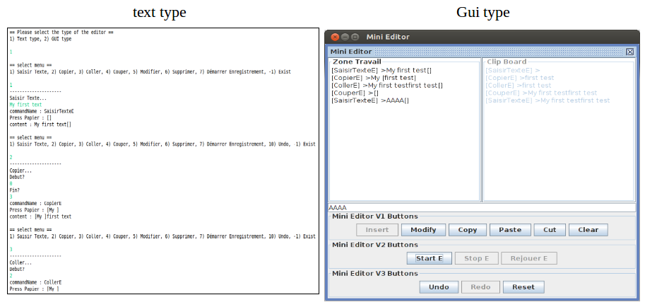
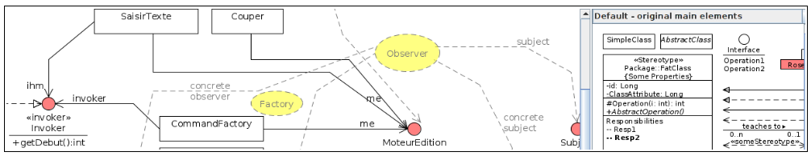
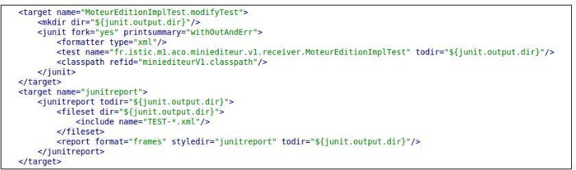
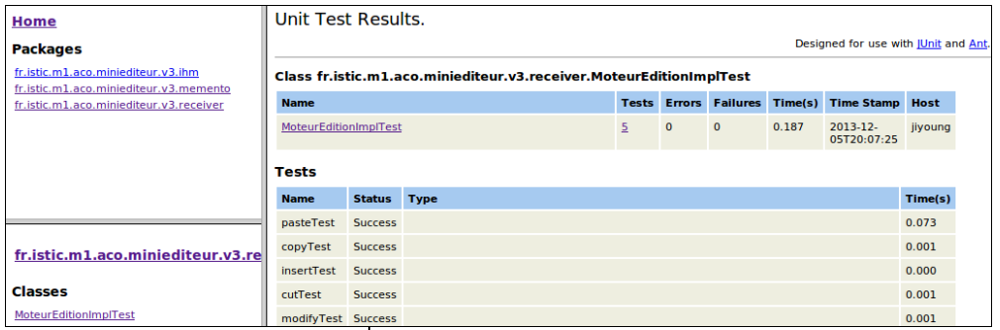
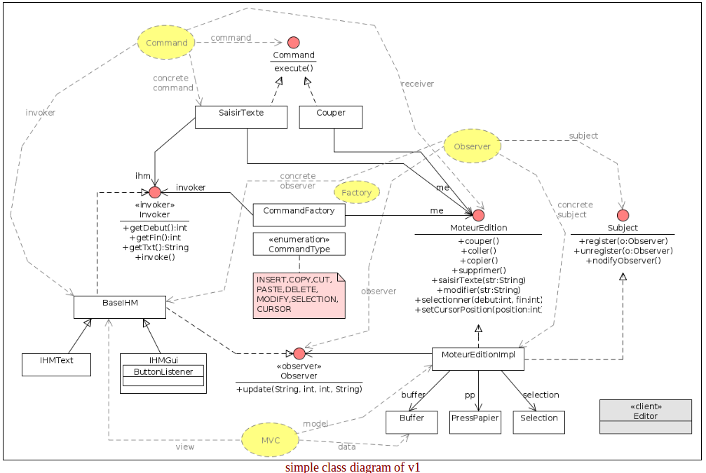
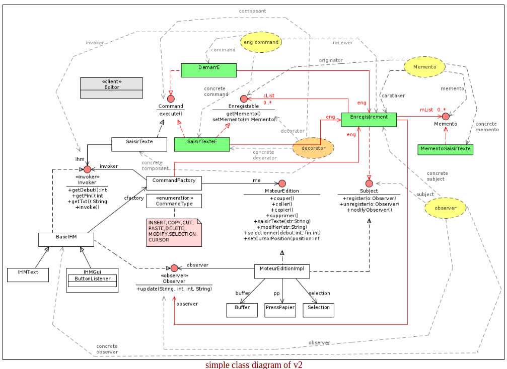
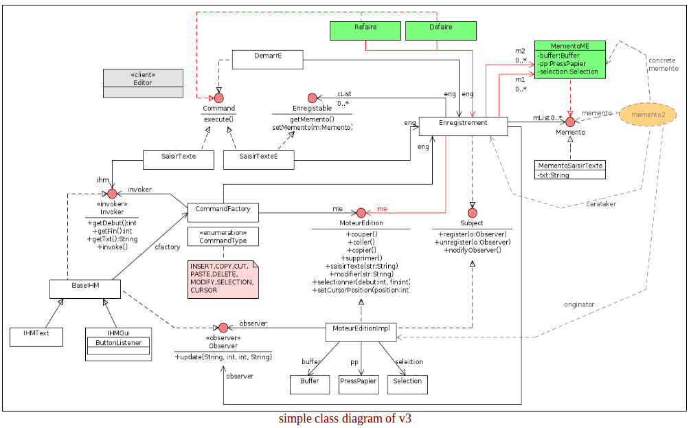

Mini Editor
===========================
Mini Editor is an little java application witch contains sevral design patterns like command, memento, MVC, factory, observer.
Mini Editor has 2 type of the User interfaces 


### Structure of the project
Mini Editor project follows the Maven standard structure which allows for users to immediately feel at home in another Maven project.  The advantages are analogous to adopting a site-wide look-and-feel.

#### Technologies
 - Java Swing : Swing is the primary Java GUI widget toolkit. It is part of Oracle's Java Foundation Classes (JFC) — an API for providing a graphical user interface (GUI) for Java programs.
 - Log4j : Apache log4j is a Java-based logging utility. It was originally written by Ceki Gülcü and is now a project of the Apache Software Foundation. log4j is one of several Java logging frameworks.
In this project, I used the console logger to print out all messages without ‘System.out.println’ . The level of the root logger is INFO.
 - Junit : JUnit is a simple framework to write repeatable tests. It is an instance of the xUnit architecture for unit testing frameworks.
  - System Rules : A collection of JUnit rules for testing code which uses java.lang.System
```java
@Rule  public final TextFromStandardInputStream systemInMock = emptyStandardInputStream();
@Test
public void insert() {
    systemInMock.provideText("my first text\n");
    ihmText.insert();
    assertEquals(ihmText.getContent(), "my first text");
}
```
 - UMLet : UMLet is a free, open-source UML tool with a simple user interface: draw UML diagrams fast, produce sequence and activity diagrams from plain text, export diagrams to eps, pdf, jpg, svg, and clipboard, share diagrams using Eclipse, and create new, custom UML elements. UMLet runs stand-alone or as Eclipse plug-in on Windows, OS X and Linux.


- ObjectAid : The ObjectAid UML Explorer is an agile and lightweight code visualization tool for the Eclipse IDE. It shows your Java source code and libraries in live UML class and sequence diagrams that automatically update as your code changes. The image below is a class diagram of actual source code; click on it to see the editor in the Eclipse Java Perspective.
- Ant : Apache Ant is a Java library and command-line tool whose mission is to drive processes described in build files as targets and extension points dependent upon each other. The main known usage of Ant is the build of Java applications. Ant supplies a number of built-in tasks allowing to compile, assemble, test and run Java applications. 
I used the Ant to make junit test report.



#### UML diagrams
* version1


##### Design patterns used for the Mini editor version1:

   1. Command pattern
   2. Observer pattern – The synchronization between the view and the model is implemented by this pattern. The MoteurEditionImpl which implements Subject interface will notice all changes of it’s internal data(Buffer, PressPapier, Selection) to the view(BaseIHM)
   3. MVC - This design pattern imposes a separation in 3 layers
    ° The model : Represents the application data. (MoteurEditionImpl)
    ° The View : represents the user interface, with which it interacts. It performs no processing, it simply just prints the data it provides the model. (IHMText, IHMGui)
    ° The controller : It manages the interface between the model and the client. It will interpret the request it to send the corresponding view. It performs the synchronization between the model and views. In this project, the controller is IHMText and IHMGui because it has just one view.
   4. Factory - It facilitates the creation of our objects by allowing the creation of objects without having to specify the class of the object to create. This method creates a special object, which is delegated instantiation of objects.  With CommandType(INSERT, COPY...) the Command Factory returns the commands corresponding

* version2


##### Design patterns used for the Mini editor version2:

1. Memento - The memento pattern is a software design pattern that provides the ability to restore an object to its previous state. In this version 2, I Adapted memento pattern to implement Macro function. (Start Register, Stop Resister, Replay Commands registered)
    ° Originator : All the commands which implement the Enregistable interface
    ° carataker : Enregistrement 
    ° memento : Memento, MementoSaisirText, MementoSelectionner, MementoCursor
2. Decorator1 - The decorator pattern can be used to extend (decorate) the functionality of a certain object statically, or in some cases at run-time, independently of other instances of the same class, provided some groundwork is done at design time. In the Mini Editor version2, every commands related registering like SaisirTextE, CopierE, CouperE... are concrete decorator of its original component like SaisirTexte, Copier, Couper...

* version3


##### Design patterns used for the Mini editor version3:

1. Memento : To implement the Undo and the Redo functions, I adapted the memento pattern secondly.
    ° Originator : MoteurEditionImpl
    ° carataker : Enregistrement 
    ° memento : Memento, MementoME


#### Strategy unit testing, integration
To unit testing...

1. test of MoteurEditionImpl – test all the basic functions of insert, copy, paste, delete, modify...
2. test of CommandFactory – test getting right command using CommandType enumaration.
To Integration testing...
3. test of IhmText – use org.junit.Rule (A collection of JUnit rules for testing code which uses java.lang.System).
4. test of IhmGui –  get jTextField from ihmGui with the name ‘insertField’ to test.
5. test of Enregistrement – macroTest, undoTest, redoTest
